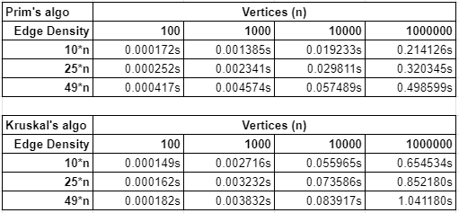

# CS 3353 Programming Project 4
This repository was created and maintained by Kirk Watson.

Student ID: 47876885

Email: klwatson@smu.edu

## Functionality
This program implements 2 different algorithms that find the Minimum Spanning Tree for a given graph.
The program reads an undirected and weighted graph from a text file.
After reading the graph, the program finds a MST using Eager Prim's algorithm and Kruskal's algorithm with a Union Find data structure.
Once the MSTs are found, the number of edges in the MST, cost of the MST, and the running time for each algorithm is displayed to the terminal.

## How to Use
To use this program, the user will need to provide a display flag and a formatted text file.

### There are 2 command-line arguments:
* Display Flag
  * -b : Brief output, only displays MST number of edges and cost
  * -f : Full output, display brief output as well as algorithm running times  
* Absolute file path to the graph .dat/.txt file
  * Formatting
    * Must contain a connected, undirected, and weighted graph
    * Takes edges separated by each line with edge values separated by a space
    * Edge values are integers and are written in this order
      * *To*   *From*  *Weight*
    * Value of the first vertex must be 0 
  * Example:  
    0 1 9  
    0 2 0  
    0 3 5  
    0 5 7  
    1 3 -2  
    1 4 3  
    1 6 4  
    2 5 6  
    3 5 2  
    3 6 3  
    4 6 6  
    5 6 1
    
## Analysis
Compare and contrast the performance of Prim’s and Kruskal’s algorithm for generating the minimum spanning trees as the size and density of the input graph increases.

To obtain the performance data of both algorithms, they were tested with 4 various sizes of 100, 1000, 10000, and 100000.
Among those sizes, there were also 3 different densities, the lowest, median, and most amount of edges possible.
With this data, we are able to see that the Eager Prim's algorithm outperformed Kruskal's algorithm as the number of vertices increases.
For lower vertice graphs, Kruskal's algorithm is able to outperform Prim's algorithm as the number of edges becomes more dense.
For the Prim's algorithm, we are able to see that as the graph becomes more dense, its performance decreases at a higher rate than Kruskal's algorithm.
These observations prove Prim's time complexity of O(E*log(V)) as well as Kruskal's time complexity of O(Elog(E)) where E is the number of edges and V is the number of vertices.
